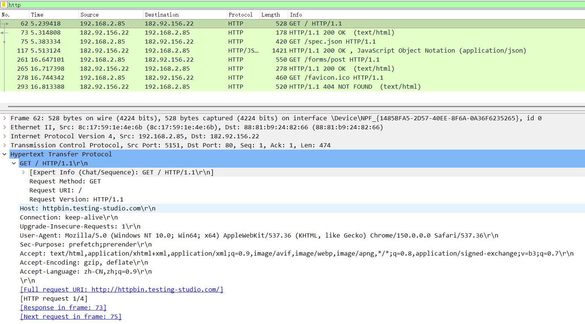
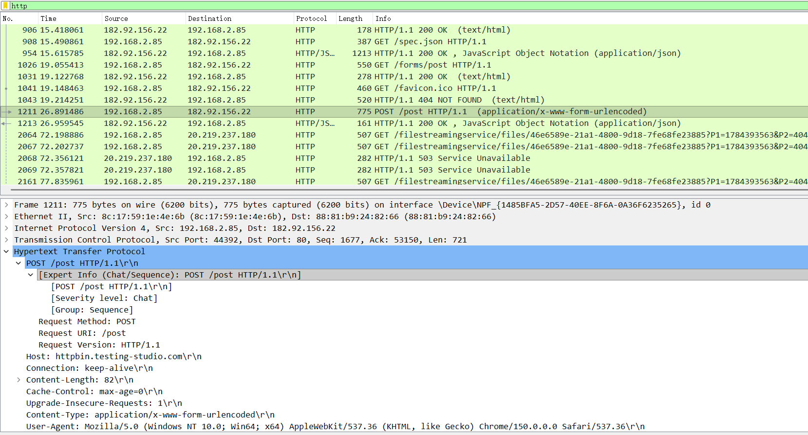
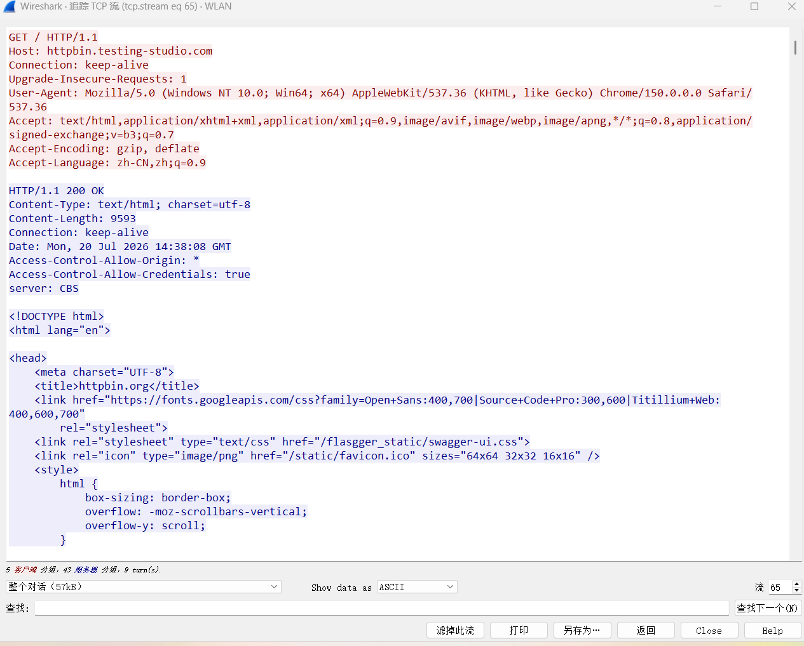

# 流量抓包分析笔记

## 一、实验目的

使用Wireshark抓取HTTP协议流量，掌握GET、POST数据包结构，学会使用过滤器筛选流量，识别请求包、响应包，技艺常见端口与HTTP状态码，完成基础网络流量分析。

## 二、实验环境与准备

1. 软件：Wireshark、浏览器
2. 前置操作：关闭迅雷、网站等占用网络的软件，减少多余干扰流量
3. 操作流程：打开Wireshark -> 选择本机上网网卡 -> 点击开始抓包

## 三、基础流量抓取与识别

步骤1：抓取HTTP-GET请求
1. 浏览器访问HTTP测试表单网站(htttpbin.testing-studio.com)
2. Wireshark显示过滤器输入：http，只筛选HTTP协议流量
3. 找到GET请求数据包
- 请求体：请求方法 + 请求地址 + HTTP版本
- 请求头：Host、User-Agent、Accept、Cookie等信息
- 请求体：GET请求没有请求体，不存在Form Data，参数一般放在URL问号后(Query参数)

步骤2：抓取HTTP-POST表单请求
1. 在网页表单输入内容，点击提交，发起POST请求
2. 在抓包列表找到对应POST数据包
3. 展开HTTP详情面板
- 请求行：展开POST /post HTTP/1.1
- 关键请求头：Content-Type:application/x-www-form-urlencoded(普通网页表单标记)
- 请求体：展开【HTML Form URL Encoded】，查看Form Data表单提交参数（页面输入的内容）

GET 与 POST 核心区别
- 数据位置：
GET：URL问号后Query参数
POST：HTTP请求体Form Data
- 请求体：GET没有，POST有
- 用途：
GET：获取网页资源
POST：提交表单数据

## 四、核心知识点记忆

1. 常见端口与对应服务
- 22：SSH远程连接服务
- 80：HTTP网页明文访问端口
- 443：HTTPS网页加密访问端口
- 3306：MySQL数据库端口
2. HTTP响应状态码含义
- 200 OK：请求成功，服务器正常返回数据
- 302：临时重定向，跳转至另一个网页地址
- 403 Forbidden：禁止访问，权限不足
- 404 Not Found：页面/资源不存在，找不到地址
- 500 Internal Server Error：服务器内部错误，程序异常

## 五、流量分析练习

1. Wireshark常用过滤语法
- 过滤全部HTTP流量：http
- 只过滤POST请求：http.request.method == "POST"
- 筛选指定IP流量：ip.addr == 192.168.x.x
2. 追踪TCP流（查看完整HTTP交互）
- 选中数据包 -> 右键 -> 【追踪】 -> 【TCP流】
- 可一次性看到完整请求包 + 完整响应包的全部原始文本，看清一次完整HTTP对话。
3. 区分请求包与响应包
- 请求包：源IP为本机IP，由电脑发给网站服务器
- 响应包：源IP为网站服务器IP，服务器返回给本机

## 六、实验截图说明

## 七、实验小结

1. GET参数放在URL，POST表单数据放在请求体Form-Data；
2. Wireshark过滤器可以精准过滤协议、IP、请求方法，过滤无关流量；
3. 通过TCP流追踪可以查看一次完整HTTP会话；
4. 端口号区分网络服务，状态码快速判断HTTP请求成功或失败。