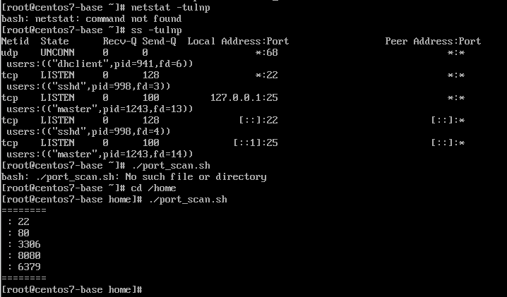

# 网络基础速查表
## 一、Linux端口查询相关命令
### 1. ss命令（系统自带，yum源失效唯一可用工具）
'''bash
ss -tulnp
参数说明：-t: TCP端口；-u：UDP端口；-l：监听状态端口；-n：数字端口展示；-p：查看占用进程PID

### 2. netstat命令（本环境不可用）
问题：CentOS7官方yum源失效，无法安装net-tools工具包，执行提示command not found，全程使用ss替代。

### 3. 自定义端口扫描脚本 port_scan.sh
报错问题记录
错误：./port_scan.sh: No such file or directory
原因：执行cd ~ 切换至root家目录，脚本存放路径为 /home，当前目录无文件。
解决方式：
1. 切换目录执行
cd /home
./port_scan.sh
2. 绝对路径直接运行
/home/port_scan.sh

## 二、本机开放端口汇总
### 实时查询（ss命令输出）
端口 | 协议 | 对应服务
22 | TCP | SSH远程管理
25 | TCP | 本地邮件服务
68 | UDP | DHCP客户端

### 脚本扫描额外端口
22、80、3306、8080、6379

## 三、通用标准端口记忆表
端口 |服务
22 | SSH
80 | HTTP
443 | HTTPS
3306 | MySQL
6379 | Redis
8080 | Tomcat
25 | SMTP邮件

## 四、HTTP状态码速记
状态码 | 含义
200 | 请求成功
302 | 临时跳转
403 | 权限不足禁止访问
404 | 资源不存在
500 | 服务器内部错误

## 五、实验截图说明
